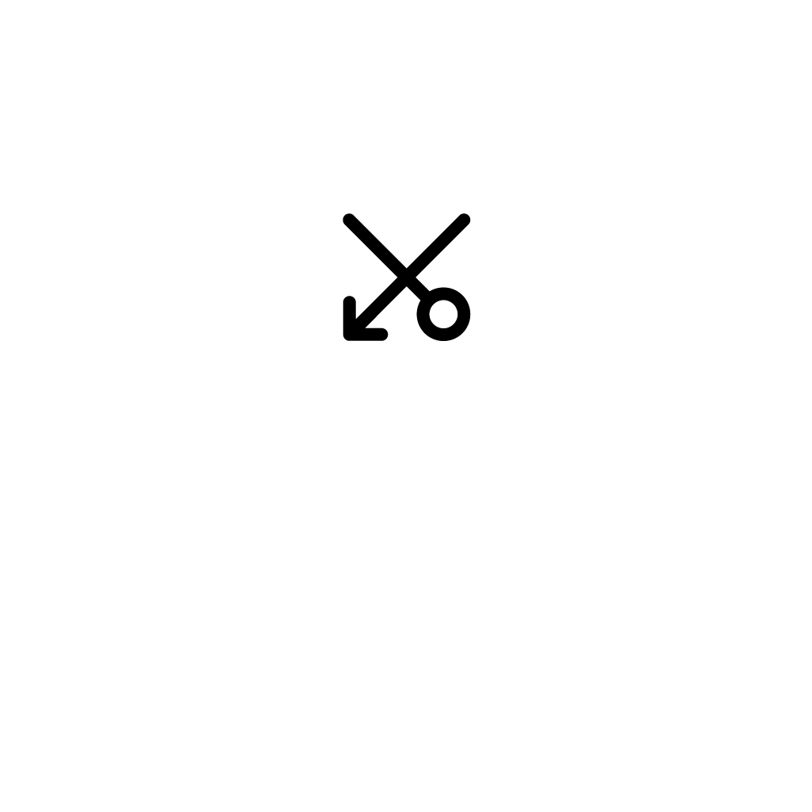
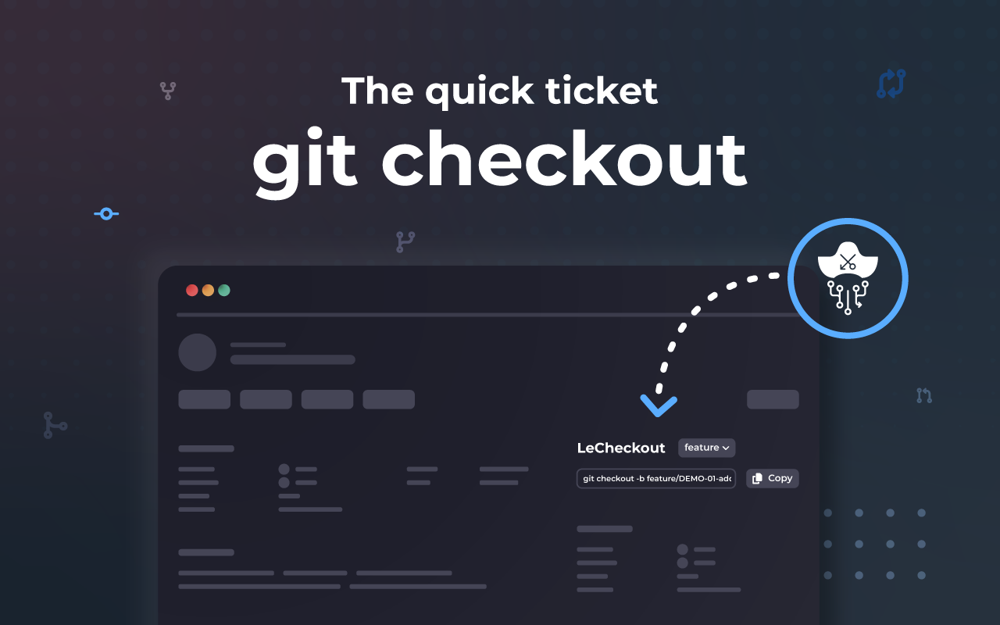

    <picture>
        <source media="(prefers-color-scheme: dark)" srcset="./resources/png/le-checkout-dark.png">
        <source media="(prefers-color-scheme: light)" srcset="./resources/png/le-checkout-light.png">
        
    </picture>

<!-- ALL-CONTRIBUTORS-BADGE:START - Do not remove or modify this section -->

<!-- ALL-CONTRIBUTORS-BADGE:END -->

# LeCheckout for Jira

_Gitbranch Generator Browser Extension_

**Working Draft**

## 📚 Summary

This is a Chrome browser extension that generates a git branch name based on the current jira issue key and the issue
summary.

:package: If you use GitHub, have a look at the [GitHub Version](https://github.com/jolution/le-checkout-github).

## 🌟 Screenshots

EN:

DE:

FR:

## 📦 Installation

### Chrome

1. Download the latest release with GitHub CLI:
   `gh repo clone jolution/le-checkout-jira`
2. Open the Extension Management page by navigating to `chrome://extensions`.
3. Enable Developer Mode by clicking the toggle switch next to **Developer mode**.
4. Click the **LOAD UNPACKED** button and select the extension directory.
5. Open a new tab and open the company jira on promise ticket directly. On the right sidebar you will find the
   extension.

## Updating

### Chrome

1. Open the Extension Management page by navigating to `chrome://extensions`.
2. Click the **Update** button.

## ✨Features

Why Use this Extension?

- Direct integration of the Jira ID
- Avoid typos in ID
- Avoid omitting the prefix
- Quick setup using copy and paste

## ❓FAQ

Why do we "need" this Extension?

In Jira, you can set up Development integration such as GitHub, if configured correctly by someone with permissions. This integration allows us to create branches directly. However, the native setup lacks the ability to easily select a prefix like `/feature/` or `/fix/`. Our extension is designed for users who do not have this feature enabled natively or who prefer to use specific prefixes.

Additionally, our extension aims to automatically prefill the prefix based on the type of Jira ticket in the future, distinguishing between bugs and features, for added convenience.

Why do you include the Jira ID in the branch title?

This allows us to make assignments more easily and, among other things, work with jira-prepare-commit-msg in projects.

For more questions and answers, please visit
our [Q&A Discussions](https://github.com/jolution/le-checkout-jira/discussions/categories/q-a).

## ❤️ Support

If you find this project helpful, please consider giving it a star
on [GitHub](https://github.com/jolution/le-checkout-jira).

We do not currently offer direct support for this project.

## 🗺️ Roadmap

### 🔄 Unifying LeCheckout Extensions for Jira and GitHub

We are excited to announce the start of the unification of [LeCheckout for Jira](https://github.com/jolution/le-checkout-jira) and [LeCheckout for GitHub](https://github.com/jolution/le-checkout-github). This consolidation aims to provide a unified and enhanced experience for users managing both Jira issues and GitHub repositories.

By bringing these two extensions together, we offer a seamless experience across both platforms, ensuring consistency and reducing the need for multiple installations.

### 🚀 Upcoming Features

- Unifying LeCheckout Extensions for Jira and GitHub
- Add Azure DevOps support
- Logo and CI design
- Optimized design for Jira On Premise and Jira Cloud
- Integration into popup variant of the ticket
- Setup option for toggle the emojis
- Setup option to hide some of the prefix branches
- Rolling out to Chrome Store
- Creating the extension for Firefox
- Add GitLab support

## ✍️ Authors (in alphabetical order)

- [@juliankasimir](https://www.github.com/juliankasimir)
- [@pimmok](https://www.github.com/pimmok)

## 💎 Sponsor (in alphabetical order)

### Eviden

We appreciate the support from [Eviden](https://eviden.com), helping us continue our open source work.

---

### JetBrains

Many thanks to [JetBrains](https://jetbrains.com), which provided us with a yearly license for all their programs for
the open source work on this project.

## ⚖️ License

See the [LICENSE](LICENSE) file for details.

## ℹ️ Disclaimer

Please note that this project, LeCheckout, is not officially associated with or endorsed by the Monkey Island franchise,
its creators, or any related entities. It is an independent project developed by the open-source community and does not
claim any rights to the Monkey Island trademark or any related materials.

## ✨ Contributors

Thanks goes to these wonderful people ([emoji key](https://allcontributors.org/docs/en/emoji-key)):

<!-- ALL-CONTRIBUTORS-LIST:START - Do not remove or modify this section -->
<!-- prettier-ignore-start -->
<!-- markdownlint-disable -->
<table>
  <tbody>
    <tr>
      <td align="center" valign="top" width="14.28%"><a href="https://jochensimon.com/"> <b>Jochen Simon</b></a> <a href="#design-pimmok" title="Design">🎨</a></td>
      <td align="center" valign="top" width="14.28%"><a href="https://github.com/juliankasimir"> <b>Julian Kasimir</b></a> <a href="#ideas-juliankasimir" title="Ideas, Planning, & Feedback">🤔</a> <a href="https://github.com/jolution/le-checkout-jira/commits?author=juliankasimir" title="Code">💻</a></td>
      <td align="center" valign="top" width="14.28%"><a href="http://dikka.dev"> <b>Raik Rohde</b></a> <a href="#ideas-Sett17" title="Ideas, Planning, & Feedback">🤔</a></td>
      <td align="center" valign="top" width="14.28%"><a href="https://github.com/raj19joshi"> <b>raj19joshi</b></a> <a href="https://github.com/jolution/le-checkout-jira/commits?author=raj19joshi" title="Code">💻</a></td>
      <td align="center" valign="top" width="14.28%"><a href="https://github.com/tobi-he"> <b>tobi-he</b></a> <a href="#maintenance-tobi-he" title="Maintenance">🚧</a></td>
    </tr>
  </tbody>
</table>

<!-- markdownlint-restore -->
<!-- prettier-ignore-end -->

<!-- ALL-CONTRIBUTORS-LIST:END -->

This project follows the [all-contributors](https://github.com/all-contributors/all-contributors) specification.
Contributions of any kind welcome!
